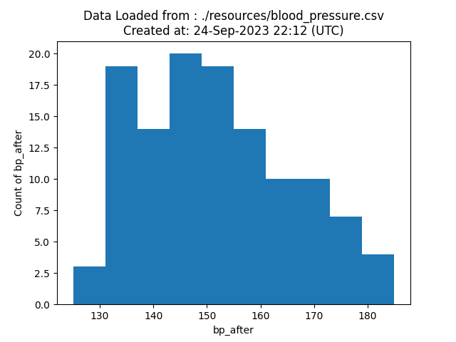
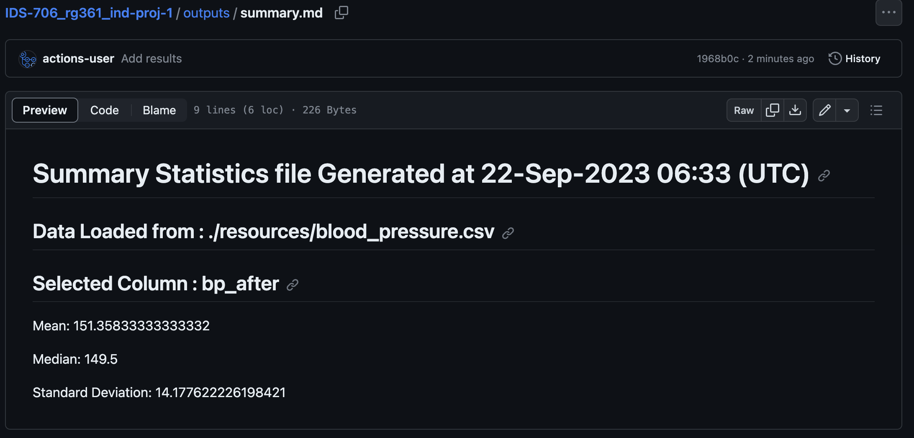

# Polars Descriptive Statistics Script and Jupyter Notebook

      

Please watch the [Youtube Video](https://youtu.be/957Sv1Bmb1Q) for a brief overview and a demo of code execution and Github Actions.

This repo contains the python script and notebook in the codes/project_files folder which perform the following general operations for the **selected column** from the dataset:
   1. calculate the descriptive statistics (mean, median and standard deviation)
   2. generate a histogram of the selcted column

The codes reads the data from the csv and stores it as a [polars DataFrame](https://pola-rs.github.io/polars/py-polars/html/reference/dataframe/index.html) for the analysis.

**Note** : The script returns the descriptive stats as list and also saves the graph and the stats to a file while the notebook displays them within the notebook

This repo has been created using the [IDS-706_rg361_week-3](https://github.com/nogibjj/IDS-706_rg361_week-3) template which was created as week-3 mini-project.

Date Created: 2023-09-16

## Instructions

Create a Codespace on main which will initialize the enviroment with the required packages and settings to execute the code.
The main project files are present in the ``codes/project_codes`` folder

### main_script.py:
The ``descriptive_stats`` function in ``main_script.py`` returns a list which contains the the [mean, median, standard deviation] of the selected column in the data. 

The code also writes these results to a ``summary.md`` file

The code stores the histogram as an image with name ``output.png``

**Note:** The code saves the summary.md and output.png in the ``outputs`` folder by default, please change this file path within main_script.py in case required

The function takes in the following 2 parameters:
   - fname (**required**) -  path or link to the csv file with the desired data
   - col (**optional**) - column number for which the statistics needs to be analyzed. if no input is given, the last column in the data is considered for analysis

   **Notes** 
   - Count the column numbers starting at 1
   - The code assumes that the data has a header row, which is the default behaviour of the ``read_csv`` function from polars which is used to read the data and create a Dataframe

### main_notebook.ipynb:
The Jupyter notebook performs the same operations as the main_script.py, however it does not save the graph or the summary file in a folder, it displays them in-line in the jupyter notebook.

The notebook can be executed in the virutal environment and the values for the dataset and columns can be modified as required.

## Codes
   all the python scripts and notebooks are present in the codes folder and organised into the following 2 directories:

   ### 1. project_codes:
   This folder contains the main scripts and notebooks which perform the functions in the repository:
   - ``main_script.py`` : contains the ``descriptive_stats`` function which returns the descriptive statistics and wirtes the summary.md and output.png files as explained earlier
   - ``main_notebook.ipynb`` : Jupyter notebook which performs the descriptive statics and plots the graph and displays them within the notebook
   - ``lib.py`` : contains the functions which are used in the main script and notebook files:
       * select_col : returns the column name for the selected column number (or last column) after verifying that they are numeric columns, else returns error code
       * summary_stats : returns the [mean, median, standard deviation] of the dataframe as a list
    
   ### 2. test_codes:
   This folder contains the following test files which are used by the github actions to verify the scripts in project_codes folder:
   - ``test_lib`` : tests the correct funtioning of the ``lib.py`` file in the project_codes folder
   - ``test_script`` : tests the correct funtioning of the ``main_script.py`` file in the project_codes folder

## Contents
### 1. README.md
   contains the information about the repository and instructions for using it
   
### 2. requirements.txt
   contains the list of packages and libraries which are required for running the project. These are intalled and used in the virtual environment and Github actions.
   
### 3. .github/workflows
   different github actions are used to automate the following 4 actions whenever a change is made to the files in the repository:
   - ``install.yml`` : installs the packages and libraries mentioned in the requirements.txt
   - ``test.yml`` : uses ``pytest`` to test the python script and jupyter notebook (also uses ``nbval``) using the test_* files in the ``codes/test_codes`` folder.
   - 
      **Note:** this action also has the trigger for automatically generating the output.png and summary.md file whenever any changes are made in the repository
     
   - ``format.yml`` : uses ``black`` to format the python script and jupyter notebooks (also uses ``nbqa``)
   - ``lint.yml`` : uses ``ruff`` to lint the python script and jupyter notebooks (also uses ``nbqa``)
   
     
   **Note** -if all the processes run successfully the following output will be visible in github actions:
   
   
### 4. Makefile
   contains the instructions and sequences for the processes used in github actions and .devcontainer for creating the virtual environment
   
### 5. .devcontainer
   contains the ``dockerfile`` and ``devcontainer.json`` files which are used to build and define the setting of the virtual environment (codespaces - python) for running the codes.

### 6. outputs
   contains the ``summary.md`` and the ``output.png`` files generated by the main_script.py file, these are automatically updated by github actions whenever any changes are made in the repository

### 7. resources 
   contains the test dataset and otherfiles which are used in the README

## Sample execution and Outputs
   a sample Dataset of [blood-pressure from Github](https://github.com/Opensourcefordatascience/Data-sets/blob/master/blood_pressure.csv) has been loaded into the resources folder and is used for testing the code.

   Following test cases are run to check the proper functioning of the code and lib files:
   1. We specify the column number (in this test, column 4 is passed as argument to the function)
   2. We do not specify a column number (in this test, no argument is passed to the funtion)
   3. Invalid Column number is given, lib and main files return error codes
   4. Non-numeric column selected, lib and main files return error codes

The codes run as expected and pass the test cases:

The following output files are automatically genrated by Github actions and stored in the outputs folder whenever there is a change in the directory:

Visualization:

Sample of summary.md file, actual file can be accessed at this [Link](outputs/summary.md):

**Note** : Only the last graph and summary are stored since the test file calls the function multiple times and the function clears the previous output before saving a new one
